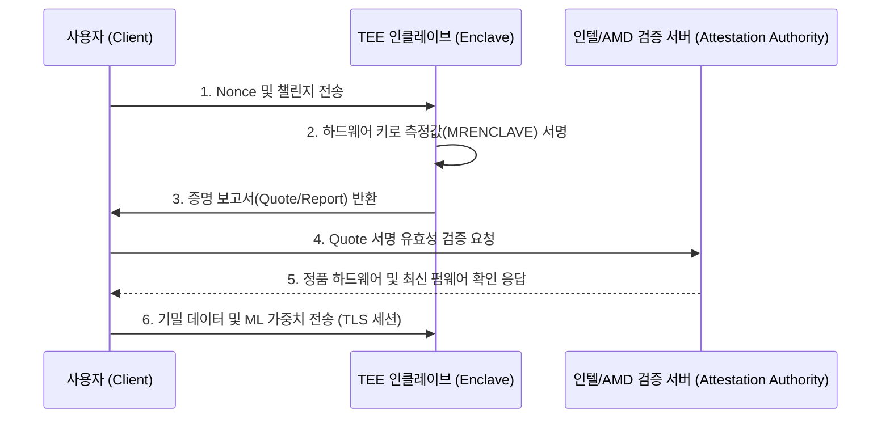

## 1. 기밀 컴퓨팅이란?

기밀 컴퓨팅(Confidential Computing)은 데이터의 세 가지 상태 중 **사용 중인 데이터(Data in Use)**를 하드웨어 기반으로 암호화 및 격리하여 보호하는 기술입니다.

- **저장 중 데이터(Data at Rest)**: 디스크 암호화 (AES-XTS 등)
- **전송 중 데이터(Data in Transit)**: TLS / HTTPS 통신 암호화
- **사용 중 데이터(Data in Use)**: **기밀 컴퓨팅 (TEE Enclave / CVM)**

---

## 2. 주요 TEE 기술 비교

| 기술명 | 제조사 | 격리 레벨 | 주요 용도 |
| :--- | :--- | :--- | :--- |
| **Intel SGX** | Intel | 프로세스 / 함수 레벨 (EPC) | 소형 보안 라이브러리, 키 관리 |
| **Intel TDX** | Intel | 가상머신 레벨 (Trust Domain) | 클라우드 CVM(기밀 가상머신) |
| **AMD SEV-SNP** | AMD | 가상머신 레벨 (Secure Nested Paging)| 클라우드 CVM, AI/ML 학습 |
| **ARM CCA** | ARM | Realm 레벨 | 모바일 및 엣지/클라우드 워크로드 |

---

## 3. 원격 증명(Remote Attestation)의 동작 과정

원격 증명은 클라이언트가 원격의 서버나 클라우드 인스턴스가 위변조되지 않은 안전한 TEE 내부에서 실행되고 있음을 암호학적으로 검증하는 핵심 절차입니다.

이와 같은 원격 증명이 성공적으로 완료된 후에만 기밀 키와 모델 가중치가 Enclave 메모리로 안전하게 복호화되어 로드됩니다.
